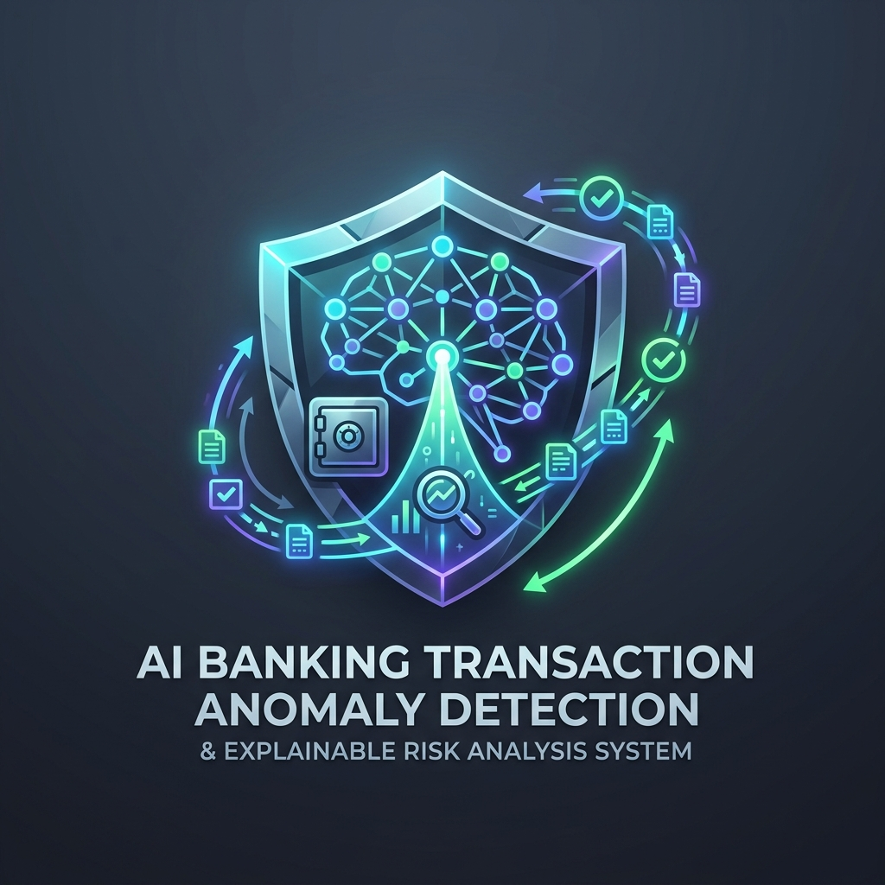

# 🛡️ AI Banking Transaction Anomaly Detection & Explainable Risk Analysis System

<div align="center">
  
  <br />
  <p><strong>Next-Generation Real-Time Anomaly Detection, Unsupervised Deep Learning, and Explainable AI (XAI) for Tier-1 Banking & Institutional Fintech</strong></p>

  [](https://vitejs.dev/)
  [](https://react.dev/)
  [](https://tailwindcss.com/)
  [](https://threejs.org/)
  [](https://shap.readthedocs.io/)
  [](https://www.bis.org/bcbs/basel3.htm)
</div>

---

## 📌 Project Overview

The **AI Banking Transaction Anomaly Detection & Explainable Risk Analysis System** (`Bank Guard AI`) provides sub-frame microsecond anomaly scoring and transparent risk factor attribution for modern payment systems. Unlike traditional "black-box" fraud scoring models, this architecture combines **unsupervised deep learning**, **graph neural networks**, and **game-theoretic Explainable AI (TreeSHAP & LIME)** to deliver human-readable explanations and auditable reason codes for every automated bank decision.

---

## 🎨 UI/UX & Visual Experience (Luxury Light Mode)

- ☀️ **Premium Light Mode Theme**: Frosted glassmorphism (`rgba(255, 255, 255, 0.85)`), deep slate typography, ambient mesh gradients, and subtle banking-blue shadows.
- 🌐 **3D Interactive Neural Globe**: Three.js WebGL & 3D canvas spherical particle matrix visualizer displaying 450 global banking transaction hubs with interactive rotation and live anomaly arcs.
- ⚡ **Real-Time Live Transaction Surveillance**: Continuous streaming table with microsecond latency, multi-channel payment tags (SWIFT, POS, ATM, UPI), and pause/inspect controls.
- 🔬 **Interactive 3D Risk Sandbox**:
  - Live parameter sliders (Payload, Velocity, Geo-Hop, Time of Origin, Device Entropy).
  - Dynamic AI composite risk gauge & automated policy enforcement (*Auto-Clear*, *Step-Up MFA*, *Block & Freeze*).
  - Real-time **SHAP Value Waterfall Breakdown** showing exact positive risk drivers vs. negative trust baselines.
- 📐 **System Pipeline & Model Benchmarks**: 4-Stage architectural design and comparative cross-model evaluation matrix (VAE, GraphSAGE, XGBoost, Isolation Forest, One-Class SVM).

---

## 🗺️ Process & Development Roadmap

| Phase | Milestone | Status | Description |
| :---: | :--- | :---: | :--- |
| **01** | **Branding & Visual Identity** | ✅ Completed | High-resolution neural-shield fintech logo and brand assets created. |
| **02** | **Frontend Core Architecture** | ✅ Completed | Workspace setup with `frontend` and `backend` root isolation. |
| **03** | **Interactive Landing & Simulator** | ✅ Completed | React 19 + Vite + Tailwind CSS landing page with Light Mode theme and 3D Neural Globe. |
| **04** | **Banking Auth & PostgreSQL (pgAdmin 4)** | ✅ Completed | Real-time banking Sign In/Sign Up portal, FIDO2/2FA simulation, and PostgreSQL schema. |
| **05** | **ML Model Training & Evaluation** | ⏳ Planned | Autoencoders, XGBoost, and GraphSAGE training on European Cardholder & Paysim datasets. |
| **06** | **Production Deployment & Docker** | ⏳ Planned | Containerization with Docker Compose and Kubernetes deployment manifests. |

---

## 📂 Repository Structure

The repository follows a clean top-level directory structure:

```
AI-Banking-Transaction-Anomaly-Detection/
├── frontend/                     # Modern React + Vite Frontend Application (Light Mode)
│   ├── public/
│   │   └── assets/
│   │       └── logo.jpg          # Project High-Resolution Logo
│   ├── src/
│   │   ├── components/
│   │   │   ├── Navbar.jsx        # Telemetry header with live latency & DB sync pill
│   │   │   ├── SignInView.jsx    # Institutional banking login with 2FA OTP & demo profiles
│   │   │   ├── SignUpView.jsx    # Multi-step account opening with dynamic tier selection
│   │   │   ├── BankingPortalModal.jsx # Authenticated vault dashboard & transfer simulator
│   │   │   ├── DbConfigModal.jsx # Live PostgreSQL / pgAdmin 4 connection inspector
│   │   │   ├── AuthModal.jsx     # High-security glassmorphic authentication modal
│   │   │   ├── Hero.jsx          # Hero section with 3D ThreeNeuralGlobe & live counters
│   │   │   ├── ThreeNeuralGlobe.jsx # 3D Interactive Three.js particle globe
│   │   │   ├── LiveTransactionStream.jsx # Real-time transaction surveillance table
│   │   │   ├── InteractiveAnomalySandbox.jsx # Live risk simulator with SHAP attribution
│   │   │   ├── ExplainableRiskEngine.jsx # XAI methodology & Black-Box comparison
│   │   │   ├── ArchitecturePipeline.jsx  # 4-stage data pipeline diagram
│   │   │   ├── ModelBenchmarking.jsx     # Comparative ML evaluation matrix
│   │   │   ├── InstitutionalCompliance.jsx # Regulatory & audit standards
│   │   │   └── Footer.jsx        # Footer & tech stack indices
│   │   ├── context/
│   │   │   └── AuthContext.jsx   # Auth & PostgreSQL state management provider
│   │   ├── App.jsx               # Application root
│   │   ├── main.jsx              # React entrypoint
│   │   └── index.css             # Light-mode design system & 3D CSS tokens
│   ├── package.json
│   └── vite.config.js
│
├── backend/                      # FastAPI REST & PostgreSQL Services
│   ├── main.py                   # FastAPI server with JWT Auth, DB routes & Anomaly engine
│   ├── database.py               # SQLAlchemy PostgreSQL connection manager
│   ├── models.py                 # ORM models (Users, Transactions, Audits)
│   ├── schemas.py                # Pydantic request/response validation
│   ├── auth.py                   # Bcrypt password hashing & JWT token security
│   ├── init_db.py                # Automated PostgreSQL initializer
│   ├── schema.sql                # SQL initialization script for pgAdmin 4 Query Tool
│   ├── .env                      # Environment configurations
│   ├── requirements.txt          # Python dependencies
│   └── README.md                 # Backend & pgAdmin 4 setup guide
└── README.md                     # Project Documentation & Process Guide
```

---

## 🛠️ Quick Start & Local Development

### Prerequisites
- **Node.js**: v18+ (tested on Node v24)
- **npm**: v9+ (tested on npm v11)

### 1. Launch Frontend Application
```bash
# Navigate to frontend directory
cd frontend

# Install dependencies
npm install

# Start development server
npm run dev
```

Open **`http://localhost:5173`** in your browser to explore the live light mode landing page, 3D neural globe, real-time transaction stream, and interactive XAI risk simulator.

### 2. Build Production Bundle
```bash
npm run build
```

---

## 📜 Compliance & Ethics Statement

This system adheres to the European Union AI Act and GDPR Article 22 requirements for algorithmic transparency in financial services. All automated decisions are accompanied by deterministic mathematical reason codes (SHAP/LIME) with continuous human-in-the-loop review capabilities.

---

<div align="center">
  <sub>Developed for next-generation institutional banking intelligence.</sub>
</div>
